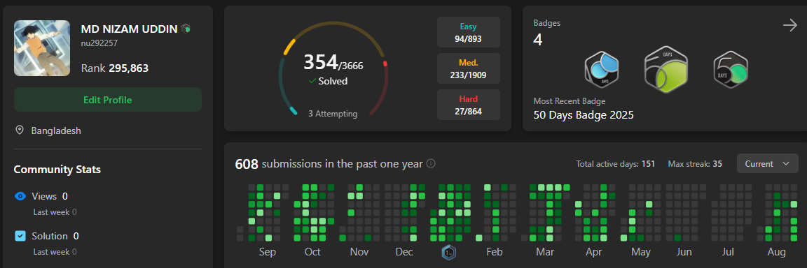
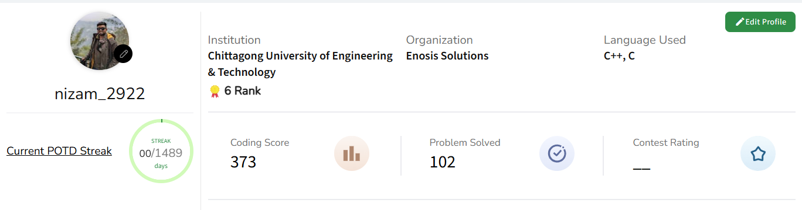
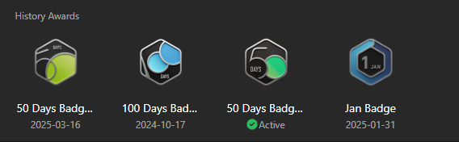

<!--horizontal divider(gradiant)-->

<!--h1 without bottom border-->

  <ul align="center">
    
<h1 style="display: inline-block">Hi 👋, I'm Nizam</h1>

  </ul>

<!--h2 without bottom border-->

  <ul align="center">
    
<h2 style="display: inline-block">Welcome to my profile</h2>

  </ul>

<!--Intro start-->
- 🔭 I’m currently working on development and R&D of different topics in **Vue.js, Three js, Webgl, VR, AR**

- 🌱 I’m currently working as a Senior Software Engineer at **Enosis Solutions**

- ☁ Completed my B.Sc in CSE from Chittagong University of Engineering and Technology

- 💬 Ask me about **mongo db, three js, Webgl, GLSL, VR, AR**

- 📫 Feel free to reach me out **nu292257@gmail.com**

<!--Intro end-->

<!--- stats & Trophy (start) -->

<table align="center">

<tr border="none">

My Coding Profiles

</tr>

<tr border="none">

</tr>

<tr border="none">

</tr>

</table>

<!--- stats (end) -->

<!--- trophy (start) -->

<table align="center">

<tr border="none">

My fun badges in Leetcode

</tr>

<tr border="none">

</tr>
</table>

<!--h1 without bottom border-->

  <ul align="center">
    
<h2 style="display: inline-block">Technologies That I Mostly Use 👨💻</h2>

  </ul>

<!--tech stack icons-->

  <a href="https://skillicons.dev">
    

      <!-- Custom icons -->
      
      
      
      
      
      
      
      
    

  </a>

<!-- Connect with me -->
<!--h2 without bottom border-->

  <ul align="center">
    
<h2 style="display: inline-block">Connect With Me🤝</h2>

  </ul>

<!--icons and links-->

  <!-- Facebook -->
  

<!--horizontal divider(gradiant)-->

----------------------------------------------------------------------
